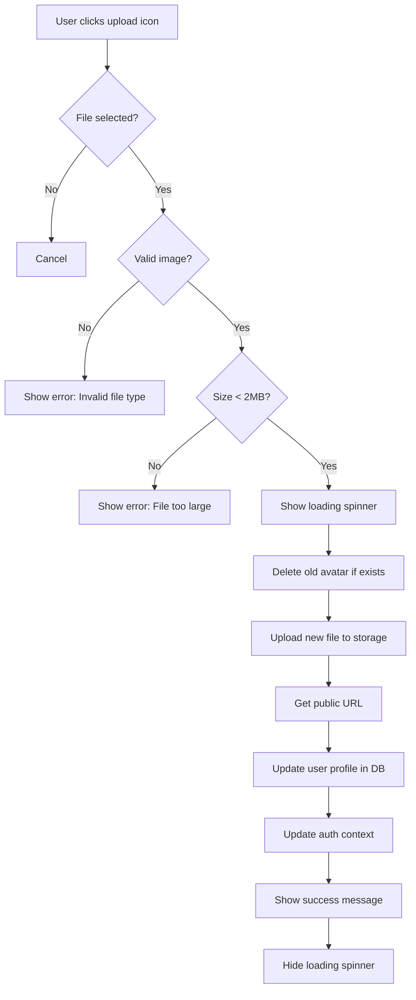

# Profile Picture Upload & Password Update Fix

## Overview

Added profile picture upload functionality and fixed the stuck password update button issue across all dashboard settings pages (Admin, Client, Employee).

## ✅ Features Implemented

### 1. Profile Picture Upload

- **Upload Method**: Click the upload icon on the avatar to select and upload an image
- **File Validation**:
  - Only image files accepted (jpg, png, gif, etc.)
  - Maximum file size: 2MB
- **Storage**: Images stored in Supabase Storage `avatars` bucket
- **Auto Update**: Profile picture updates instantly across all dashboards

### 2. Password Update Button Fix

- **Issue**: Button getting stuck in loading state after password update
- **Solution**: Added dedicated `isChangingPassword` guard flag to prevent race conditions
- **Applies to**: All three dashboards (Admin, Client, Employee)

## 🗂️ Files Modified

### Admin Settings

- `app/dashboard/settings/page.tsx`
  - Added `uploadingAvatar` state
  - Added `isChangingPassword` guard flag
  - Implemented `handleAvatarUpload()` function
  - Updated password change handler with guard
  - Added upload icon button overlay on avatar

### Client Settings

- `app/dashboard/client/settings/page.tsx`
  - Same updates as Admin settings

### Employee Settings

- `app/dashboard/employee/settings/page.tsx`
  - Replaced URL input with upload button
  - Added same avatar upload functionality
  - Fixed password button with guard flag

## 📋 Setup Requirements

### 1. Supabase Storage Bucket Setup

Run the SQL script to create the `avatars` bucket:

```bash
# Run in Supabase SQL Editor
SETUP_AVATARS_BUCKET.sql
```

This will:

- Create the `avatars` storage bucket (public)
- Set up RLS policies for user uploads
- Allow public read access to avatars
- Allow users to update/delete only their own avatars

### 2. Verify Storage Bucket

1. Go to Supabase Dashboard → Storage
2. Verify `avatars` bucket exists and is set to **Public**
3. Check RLS policies are enabled

## 🎨 User Interface

### Avatar Upload

```
┌─────────────────────────────────┐
│  Profile Information            │
├─────────────────────────────────┤
│                                 │
│   ┌──────┐                      │
│   │  AV  │  ← Avatar            │
│   │  📤  │  ← Upload icon       │
│   └──────┘                      │
│   User Name                     │
│   user@example.com              │
│   Click icon to update picture  │
│                                 │
└─────────────────────────────────┘
```

### Password Update

- Button disables during update
- Shows loading spinner
- Uses separate `isChangingPassword` flag (not shared `saving` state)
- Resets properly after success/error

## 🔒 Security

### Storage RLS Policies

- ✅ Users can only upload to their own folder (filename starts with user ID)
- ✅ Public read access for all avatars
- ✅ Users can only update/delete their own avatars
- ✅ 2MB file size limit enforced client-side

### File Validation

```typescript
// Type check
if (!file.type.startsWith("image/")) {
  alert("Please select an image file");
  return;
}

// Size check
if (file.size > 2 * 1024 * 1024) {
  alert("Image size must be less than 2MB");
  return;
}
```

## 🚀 How to Use

### Upload Profile Picture

1. Navigate to Settings page
2. Click the **upload icon** (📤) on the bottom-right of your avatar
3. Select an image file (max 2MB)
4. Avatar updates automatically
5. Success message appears

### Update Password

1. Navigate to Settings → Security tab
2. Enter new password (minimum 6 characters)
3. Confirm new password
4. Click "Update Password"
5. Button shows loading spinner
6. Success message appears
7. Password fields clear automatically

## 🐛 Bug Fixes

### Password Button Stuck Issue

**Problem**: Button remained in loading state after password update

**Root Cause**:

- Used shared `saving` state for both profile and password updates
- Race conditions when component re-renders
- State not properly reset in some edge cases

**Solution**:

- Created dedicated `isChangingPassword` boolean flag
- Guards against multiple simultaneous password changes
- Always resets in `finally` block
- Separate from profile save operations

### Before

```typescript
async function handleChangePassword(e: React.FormEvent) {
  setSaving(true); // ❌ Shared state
  // ... password update logic
  finally {
    setSaving(false);
  }
}
```

### After

```typescript
async function handleChangePassword(e: React.FormEvent) {
  if (isChangingPassword) return; // ✅ Guard check

  setIsChangingPassword(true);   // ✅ Dedicated flag
  setSaving(true);
  // ... password update logic
  finally {
    setSaving(false);
    setIsChangingPassword(false); // ✅ Always resets
  }
}
```

## 📸 Avatar Upload Flow



## 🧪 Testing Checklist

### Avatar Upload

- [ ] Can upload JPG image
- [ ] Can upload PNG image
- [ ] Rejects non-image files
- [ ] Rejects files > 2MB
- [ ] Old avatar deleted when uploading new one
- [ ] Avatar updates across all pages immediately
- [ ] Loading spinner shows during upload
- [ ] Success message appears
- [ ] Error message appears on failure

### Password Update

- [ ] Button disables when passwords don't match
- [ ] Button disables when password < 6 chars
- [ ] Loading spinner appears during update
- [ ] Button re-enables after success
- [ ] Button re-enables after error
- [ ] Success message appears
- [ ] Fields clear after success
- [ ] Works in Admin settings
- [ ] Works in Client settings
- [ ] Works in Employee settings

## 💡 Tips

### For Users

- Use square images for best avatar display
- Keep file size under 500KB for faster uploads
- Supported formats: JPG, PNG, GIF, WebP
- Password must be at least 6 characters

### For Developers

- Avatar filenames include timestamp to prevent caching issues
- Old avatars are automatically deleted to save storage
- Uses Supabase public URLs (no signed URLs needed)
- Guard flags prevent duplicate API calls
- All state properly cleaned up in `finally` blocks

## 🔧 Troubleshooting

### Avatar not uploading

1. Check Supabase Storage bucket exists and is public
2. Verify RLS policies are enabled
3. Check file is valid image and < 2MB
4. Check browser console for errors

### Password button stuck

1. Check browser console for errors
2. Verify Supabase auth is working
3. Try refreshing the page
4. Check network tab for failed requests

### Avatar not displaying

1. Check avatar_url in user profile
2. Verify public access to avatars bucket
3. Check image URL is accessible
4. Try hard refresh (Cmd+Shift+R)

## 📝 Notes

- Avatar uploads are instant (no approval needed)
- Old avatars are deleted automatically
- Profile picture updates reflect immediately in auth context
- Password changes log user out on some devices (Supabase default)
- Success messages auto-dismiss after 3 seconds
- Error messages auto-dismiss after 5 seconds
